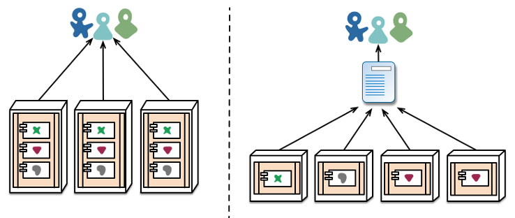
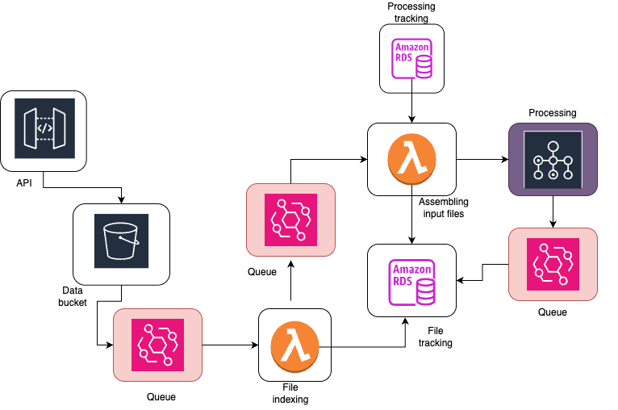
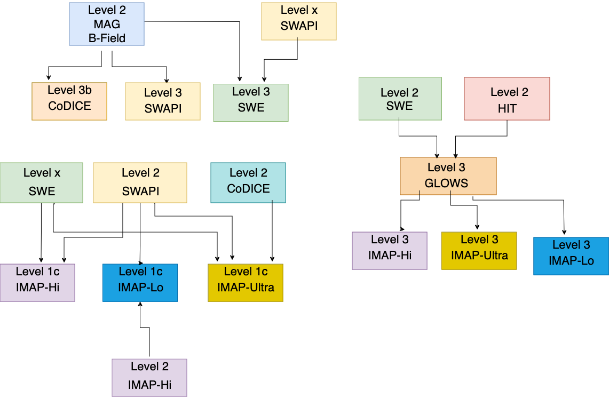

# IMAP Design Philosophy

This section will cover some of the tools we use and some of the design philosophy for running repeatable, reliable, maintainable, and fast processing.

## Infrastructure as code

Infrastructure as code is not only a cloud related concept, but it is often found in the cloud space. When running in the cloud, it is all too easy to completely delete all your servers by accident with the press of a button. Ease of bringing up these services can be a double-edged sword - it's also easy to bring them down again, and more than that, pieces of infrastructure tend to proliferate, and it's difficult to track where everything ends up. After years of running a system, without some tool in place to ensure it doesn't happen, it can be disastrous trying to determine exactly what servers were running, where, why, and with what configuration. 

This is where infrastructure as code comes in. Every piece of IMAP infrastructure is stored as a piece of code in a repository, and the entire system can be destroyed and recreated within a few hours. This is partly to meet one of our requirements to recover from a total loss within 30 days, but also ensures that the infrastructure side of things is as closely tracked, reviewed, and documented as the rest of the code. The system can get very complex, and having a way to restore previous versions, create test instances in different accounts, and track changes makes running long term a lot simpler. 

Infrastructure as code can be used in on-prem servers too, and I highly recommend it even for simple systems. It's an extra layer of protection, and makes maintenance and migrations so much simpler for everyone. 

It acts like a blueprint for complex infrastructure code, to formally define the structure of the processing code.

:::{figure-md} house-blueprint

House blueprint
:::

The question of if you should use infrastructure as code is pretty settled (yes, you should!) but the question of tooling remains, as always, up for debate. There are many tools out there for setting up on-prem servers (Ansible, Puppet, and Chef are a few). For setting up cloud infrastructure, the two that we debated were CDK and Terraform. 

Having used both, I can say with confidence that using CDK is a lot easier. It uses an existing language for its base (in our case, we use the Python version) making it powerful but also surprisingly easy to learn. That's not to say it's particularly easy to use, but it does take care of a lot of the difficulties of keeping a remote web of servers, where someone can go in and manually update them, in sync with a mostly static piece of code. The biggest drawback, and the dealbreaker for a lot of people, is that it is only available and only able to set up AWS code. 

Terraform, on the other hand, is part of a class of software known as "cloud-agnostic" meaning that, in theory, you could run a piece of terraform code on AWS and on Google's cloud platform or Azure, and it would behave the same way. 

In practice, though, making sure your infrastructure as code is cloud-agnostic is a lot of work. It also is a lot of work to switch platforms, so it's not something a project should expect to do often. In one of my previous roles, I actually did help migrate a system written in Terraform from AWS to Azure, and we ended up needing to rewrite most of it anyway, because the systems were so different. In my opinion, for most use cases, it's not worth the effort. Most of the work on the IMAP infrastructure has been on general design or on code running inside ephemeral processing containers (called lambda in AWS), which would both transfer to any new provider if we did switch. However, just like the debate on running on the cloud at all, this is heavily debated and highly case-specific. 

## Containerization

We also heavily use containerization using Docker for our services. This allows users to run the same code on individual computers or in the cloud. Similar to the infrastructure-as-code tools, it also explicitly defines requirements for running software to create repeatable and well-defined environments. We use Docker for all our services, which is also well-integrated into AWS. 

## Microservices

What is a lambda, exactly? Lambda is the AWS-specific name for a short running process (maximum of 15 minutes) which can be quickly spun up, ran, and spun down again. These short-running processes form the backbone of a lot of our infrastructure, and they are what is called a _microservice_. 

Microservices became quite popular in the age of cloud computing, partly because of the ease of creating and running these services, and partly because they are quite cheap to run. As small, fast running processes, they are ideal for filling in gaps of real computing in the cloud. This also makes them inexpensive to run for the users.

:::{figure-md} microservices

Microservices
:::

Microservice is a general term for these kinds of smaller processes. They don't all need to be short-lived and frequently run, like lambdas. The main key is that each microservice has a limited sphere of responsibility. Just like when building code, there are a lot of advantages to keeping the scope of responsibility small for services. 

Each microservice is a little piece of the factory. Everyone takes something in, builds a very specific piece on, and then hands it forward to the next service. A good rule of thumb for the size of a microservice is that it should be small enough for one developer to rewrite in one day. 

#### Advantages of Microservices:

**Scalability**: With microservices, you are able to scale each piece of the processing separately from every other piece. Within our processing, we start broad when files arrive, to ensure we don't miss any by accident. However, as we go, we decide at various steps not to continue in the pipeline. For every file that arrives, we definitely want to index it in our database. However, we may not want to actually run any processing on that file. Since the indexing and the processing occur at separate places, we can have our lightweight indexer run frequently, but keep the heavier, more expensive servers for processing dormant until they are necessary. 

**Deploy pieces separately**: This is a major advantage during development and troubleshooting. If we update a small piece of the pipeline, we don't need to redeploy the entire thing. Similarly, if one of the steps fails, it's very clear where the bug is inside the code. This helps with maintainability and long-term stability too, since we can be confident the only piece being affected is the one we modified. 

**Separate responsibilities**: Just like how dividing responsibilities clearly within one piece of code using functions and classes results in a piece of code that is clear and easy to understand and reuse, so does dividing the actual services by responsibilities. When each service only has one function, they are easier to string together and far more reusable than one service that does everything in a highly specific way. In the long run, this even could help for reusability across different missions. 

**Running in parallel**: Similar to the scaling question, this helps the overall speed of the system. Everything that can be run in parallel, will be run in parallel. If we have correctly divided pieces into discrete chunks, we should never be running code in series when it could be in parallel. Any task that can run independently in our system, does. Often, in our case, this means each of our ten instruments can run completely separately and in parallel on the same architecture. 

**Easy to replace**: If you need to insert a new step in your processing, or rework something that isn't working, it is easy to swap out pieces of the system as long as you correctly match inputs and outputs. When we determined that the dependency system we had in one of our services was actually far more complicated than what we needed, we pulled it out into a new service. This didn't affect anything except the original service, but now both pieces of code are vastly simplified, and the dependency system is reusable for other tools that need the information. Similarly, we have rewritten whole pieces of code without needing to do extensive refactoring elsewhere. In some ways, it can feel like swapping out pieces of the car while you're driving it, but at least you can do it one steering wheel or pedal at a time, instead of needing to take half the car out!

## Connecting everything together

I have talked a bit about swapping pieces out and matching up APIs, but what does this actually look like? What are we actually passing around? What is used to pass information around? 

This is where queues come in. They act as the wires on the circuit board of our system, passing around packets of data and connecting related services together. They can filter or limit calls to services, sort outputs, and track data as it moves through each service. In our case, we use Amazon Eventbridge, but there are plenty of tools and services to accomplish this, including ones you can run on-prem (Kafka). 

Queues are a great way to solve lots of the problems with moving data around and triggering code to run. However, running them on-prem is expensive and difficult, with a lot of monitoring and tweaking needed to ensure the queue runs smoothly. If you're a small team, or working with small amounts of data, it isn't worth the developer time to get the convenience. However, in AWS, we don't have to worry about those things, as AWS already does them for us! They're cheap to use for the end user, so we can get all the advantages and none of the disadvantages. 

Queues are a key element to ensuring you are never running code and servers when you don't need to, which if you'll remember, is key in cloud development. They are a powerful tool that help wire together anything more complicated than one service directly calling another every time it runs. They can also solve concurrency issues, which is something we did encounter in IMAP - things were a little _too_ parallel, and the same service was getting triggered two times simultaneously. The easy fix was to stick the triggers in a queue, sorted by instrument, so we would only run each process one at a time for each instrument. 

:::{figure-md} imap-pipeline

Overview of the IMAP processing pipeline.
:::

This is a (simplified) diagram of our processing pipeline which highlights where we use queues (in red.) Queues connect different pieces of architecture together and are a critical part of the overall design. 

## Event Driven Processing

What is actually getting passed around in these queues? What are the real advantages of setting a system up like this? Although, yes, it is nice that things are separate, it probably doesn't seem worth the added complexity and effort. Why not just stick everything in one big server and do it all at once?

For IMAP, a key goal of the overall science is to cross-calibrate different instruments. This means that all the instrument processing is intermingled, with some high levels of one instrument going into the low levels of another instrument. Due to this requirement, we aren't able to process all level 1 data files, then all level 2 data files, then all level 3 data files, but instead need to be more flexible with our processing design. 

:::{figure-md} deps

Overview of the IMAP science file dependencies.
:::

Event driven processing can help reduce some of the complexities that are introduced here, especially when we start talking about reprocessing. _Event driven processing_ is a system of design which ties back into the ideas of only running code when you need to. It's all well and good, but how can you decide when you _need_ to run code? What is running through the wires of the queues? What are the microservices passing around? 

It's all events. "Event" is a nice, generic word for a small notification or piece of information which can contain _just_ enough information for the next step in processing. This can be all the information needed, or it could be that the processing then goes to retrieve the other pieces.

In IMAP's case, the very first event is when a file arrives. We get raw binary files directly from the spacecraft, already organized by instrument and day for processing. We call these level 0 files. As soon as a level 0 file arrives, we have a watchdog in AWS which sends an event to our indexer with the filename. The indexer takes this file name, populates our file tracker database, and sends another event to our _batch starter._

The batch starter is the piece of infrastructure which determines if we should run processing. In the case of L0, the main question is, "do we have all the other files necessary for processing?" 

If we do, this is the easy case. Sometimes we only need one file. The batch starter asks our dependency service to determine what files are needed and if we have those files. The dependency checker sends back either a list of files, or a "no, we are missing dependencies for that file." Then, the batch starter assembles all the information needed to run processing (things like, what instrument do we have, what the upstream filenames are, and what date we should generate for) and starts the AWS Batch process which handles all that. 

If we are missing a file, we stop here and wait for the file to arrive. Every arriving file re-triggers this checking process, so as soon as all the files are available we can begin processing. This really reduces the amount of time that we are waiting for all files to arrive, because we can ensure we start processing (in parallel) as soon as every file is available for that given step. 

This ensures that scientific data is available as quickly as possible. In IMAP, we have several instruments that average data across multiple months for their final science. On the other hand, we have instruments that don't need to wait months for the completed data. We can handle both of these cases in the same system in a totally decoupled way, so the data that is quick to process and produce is also quick to be released. 

This event driven system allows us to see immediate results from the overall design of our infrastructure. Our end users are happy to know they are getting data quickly, but we're still able to handle the complex dependency tree of IMAP. 

Although we do see a lot of benefits from this event-driven system, it is not required for a cloud-based system (although it is a popular paradigm). It would be simple to trigger some pieces on a time-based, batch oriented system as well. In fact, we also need to accommodate this case within our system, as we will have larger reprocessing runs that reprocess the entire mission on a fairly regular basis. Just like with the microservices, we are able to mix event-based and time-based processing based on different requirements and use cases. However, event based processing does make it simple to modify systems without worrying about race conditions, and it is a pretty natural fit for the microservices model.

