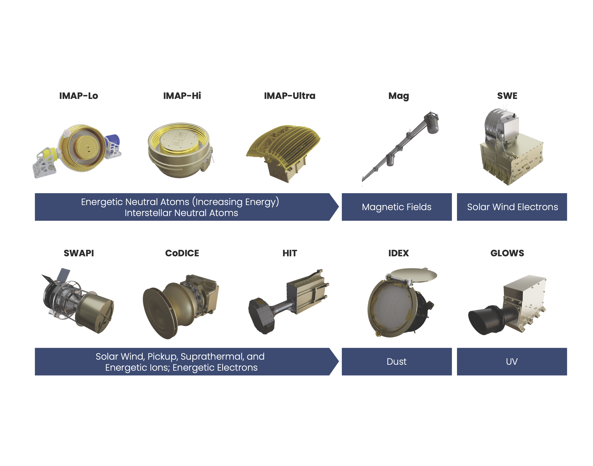

# Overview
This paper describes some of the design choices and motivations for the infrastructure supporting science data processing and access for the IMAP mission. This infrastructure is built in a cloud-first environment, taking advantage of being developed for the cloud from the beginning. 

## Background and Motivation

[IMAP](https://imap.princeton.edu/), or the Interstellar Mapping and Acceleration Probe, is a mission launching in September 2025. It is a deep space heliophysics mission, hosting 10 instruments which will study energetic particles known as Energetic Neutral Atoms (ENAs) and the solar wind, among other things, at L2. 

:::{figure-md} imap-instruments

IMAP instruments
:::

The Science Data Center (SDC), which is run by the Laboratory of Atmospheric and Space Physics (LASP) at CU Boulder, is responsible for the development of low-level processing for all instruments, as well as running all levels of processing, producing valid science files, hosting all files to be accessible by scientists, and sending all relevant data to the heliophysics archive at the Space Physics Data Facility (SPDF), among other things. 

Each instrument has multiple "levels" of data, which indicate data quality and refinement. These range from Level 0, which is raw packets data, all the way through Level 3, which is suitable for scientific research. 

All the processing will occur in the cloud using Amazon Web Services (AWS), and all code is open sourced and freely available on [Github](https://github.com/IMAP-Science-Operations-Center). 

Since we developed against AWS from the start, we are able to experiment with creating a cloud-first design, rather than having to move existing code or structures into the cloud. There are some significant advantages to developing this way, which will be covered at a high-level within this paper. 

## Cloud advantages and Disadvantages

Usage of cloud based infrastructure, particularly that which is provided by large, for-profit companies such as Amazon, Google, and Microsoft, has been the subject of hot debate in some of the recent scientific software conferences I have attended. Although these tools are well established and widely used, there is still consistent discussion of the pros and cons, particularly for scientific data processing and access. 

Therefore, this will be far from an exhaustive overview of the various pros and cons, or of the many variations between cloud providers. However, neither can I avoid these topics entirely, as it is a relevant question when discussing the choices we made in our infrastructure design, particularly since so many of these design choices would be much more difficult in an on-premise environment. 

Forewarning: the words "processing" and "processes" do a lot of heavy lifting in this section. Here, they are used as a generic name for any code running in service of whatever you're trying to accomplish - so for IMAP, that's things like running our web API, running actual science algorithms, determining when processing should occur, etc. 

When using the cloud for processing, generally, the user is paying for increased convenience. Rather than running servers, staffing people to run those servers, and staffing for security and ongoing maintenance, all those costs are offloaded to Amazon, with a nice cut off the top. In some cases, it isn't worth making that trade, but hiring people to manage all that work is expensive. AWS has massive advantages in nearly every domain because they have so much scale. This scale allows for more efficient use of resources at all levels. 

For example, consider processing on a variable-length input, such as the number of concurrent users of a website. In order to handle the maximum number of users, you need to have 100 servers running your processing code. Otherwise, people get timeouts, and you lose money. However, this load is highly variable. If your website is a shopping website, you're going to have far fewer users in the middle of the night. On the other hand, you may have far more users during heavy shopping periods, such as before Christmas. 

If you needed to run all 100 servers all the time, you would be losing money having to buy upgrades, pay someone to track and fix issues, paying electricity and rent, etc. This is one of the advantages of running in the cloud - you can scale up any time of day, and only pay for what you're using. AWS are the ones running the servers, so you save on all the extra unused processing power you would otherwise need. Even if the servers you are using are a lot more expensive, it starts to make sense quickly. 

What happened to all the unused processing space? AWS sold it to someone else. They don't need to worry (as much) about unused server time, because there is always something else they can schedule in. 

### Scientific Computing in the Cloud

Although scientific processing is generally quite different from running code to process shopping website users (speaking as someone who has done both), within space science we can have periods of high usage and periods where we are sitting idle. IMAP downlinks only occur every three days, so we have bursts of processing, then periods of waiting for the next data downlink. 

In addition, we actually have some advantages when compared to traditional applications. The biggest advantage, in my opinion, is a question of latency. Although scientists get quite cranky if you're too slow to deliver data, it's not really comparable to the sub-second latencies required for handling shopping, online advertising, scheduling, alerting, or some other common use cases. Our latency is measured in days, not milliseconds, and that's a huge advantage in the AWS model because it means we can get the cheaper tiers of nearly everything. AWS is always trying to sell off the extra servers that are not in use at any given time, so they discount any processes which use those resources. 

They also discount smaller processes, which is where scientific computing can be at a disadvantage. The rest of this paper covers this in more detail, so I won't get into it here. 

Finally, the elephant in the room for these discussions - when we talk about space missions, we are necessarily limited by the amount of data we can downlink from the satellite (IMAP is significantly smaller than the entire Earth, and significantly more difficult to connect wires to.) This makes the scale significantly smaller than some other applications which are in the scope of the ISS conference. Over the lifetime of the IMAP mission, we expect a dozen terabytes of data, in total. This generally makes things a lot easier to handle on the infrastructure side of things. 

If you're dealing with a higher volume of data, the decision-making for cloud utilization changes. On one hand, having so much data makes running your own servers even more difficult. However, you can start to see some of the advantages of scale at that point, and there are a lot of advantages to minimal movement of that data. While in IMAP we copy files around all over the place, that isn't feasible for some cases. 

